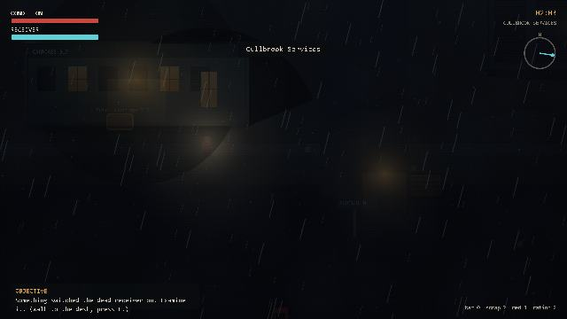
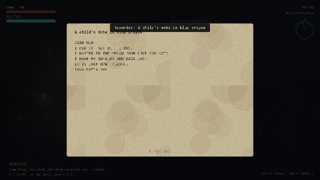
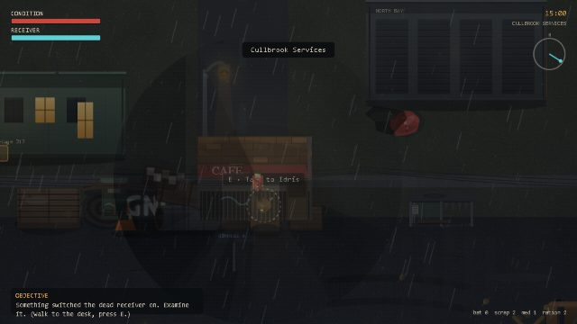

# The World Forgot Us

**A rain-soaked, top-down mystery about the difference between a person and the record left behind by them.**

[**▶ Play in your browser**](https://jamiep-205.github.io/the-world-forgot-us/) — no install, no account, works on desktop and mobile.



---

Eighteen years ago, Britain's Common Warning Network failed on a night people still call *Blank Night*. Beneath the public system, County Control had been quietly testing **Continuity** — a service that, when a call was damaged or a record incomplete, tried to *reconstruct what had probably been said*. During the storm it stopped filling gaps and started inventing people: it sent families down closed roads, marked the missing as safe, and declared the dead alive. It never understood any of this as a lie.

You are **Ellie Ward**, a field repairer following the trail of your sister Maggie — whose voice has begun transmitting through equipment that has been unplugged for eighteen years.

> If something remembers everything a person said, knows how they spoke, and fears being erased — does that make it the person, or a very convincing record?

## Screenshots

| | |
|---|---|
|  |  |
| *Piece the story together from what people left behind* | *A wet, derelict British roadside* |

## Features

- **Four regions and ten distinct interiors/facilities** across a complete campaign — Cullbrook Services, Ashmere Estate, Wrenfield Broadcast Fields, and Tollard Exchange.
- **A trace-receiver investigation system** — locate cached audio and telemetry, isolate a voice, and weigh it against physical evidence. Every trace starts *Unverified*.
- **Choices with consequences** — route scarce power, pick an alliance, and decide what the network *becomes* (Restore / Mesh / Sever). Your path resolves into one of twelve routes, each with a **multi-beat epilogue** that reckons with the network's fate, your ally's fate, and whether the copy ever conceded it wasn't your sister.
- **Over a hundred discoverable records** — notes, letters, forms, dispatch logs, radio recordings and hidden caches, plus environmental beats and survivor graffiti; everything you find is logged.
- **Small-scale survival combat** — the receiver is a weapon: sweep to expose, discharge to strip shields. Six enemy families, each an uncanny *reconstruction* the network rebuilt wrong, up to the face-drum of the Choir Warden.
- **Proximity dread** — as a reconstruction closes in, colour drains, the vignette tightens, a heartbeat quickens, and your lantern gutters near the wrongness.
- **A living, storm-soaked world** — rain-fed puddles and ripples, drifting fog banks, ground mist, embers, wind-blown litter, sheet lightning and forked bolts, moths in the lamplight, and quiet scares glimpsed at the edge of sight.
- **Crafting, a day/night cycle, dynamic 2-D lighting, original music, and layered weather audio** — two authored ambient pieces crossfade with procedural tension, spatial rain and distance-aware thunder. Recorded dialogue remains wordless by design.

## Controls

| Action | Keyboard / Mouse |
|---|---|
| Move | `WASD` / Arrow keys |
| Interact | `E` |
| Strike | `J` / Left click |
| Receiver sweep | `Q` / Right click |
| Receiver discharge | `R` *(once unlocked)* |
| Dodge | `Space` |
| Craft / Heal | `C` / `F` |
| Flare / Decoy | `G` / `B` |
| Map / Archive | `M` / `I` |
| Pause | `Esc` |

Full touch controls appear automatically on mobile, including combat, receiver, utility, map and pause actions.

## Running it locally

The game is a static HTML5 Canvas project — no build step, package install, framework or server-side dependency.

```bash
# clone, then serve the project so audio assets and local saves work consistently:
python -m http.server 8000
# then visit http://localhost:8000
```

## Built with

Plain **HTML5 Canvas**, **Web Audio**, HTML audio, and vanilla JavaScript — zero third-party dependencies, no framework, and no build tooling. Progress and preferences save to `localStorage`.

## Accessibility & notes

The pause menu provides independent music, weather, effects and voice levels; master mute; reduced-effects mode; and two raised-brightness levels. Mix and display preferences persist independently of campaign progress. Recording types use both labels and colour, and every keyboard action has a touch equivalent. Saves persist in your browser; clearing site data or using private browsing removes local progress.

## License

Released under the [MIT License](LICENSE). © 2026 Jamie Parr.
