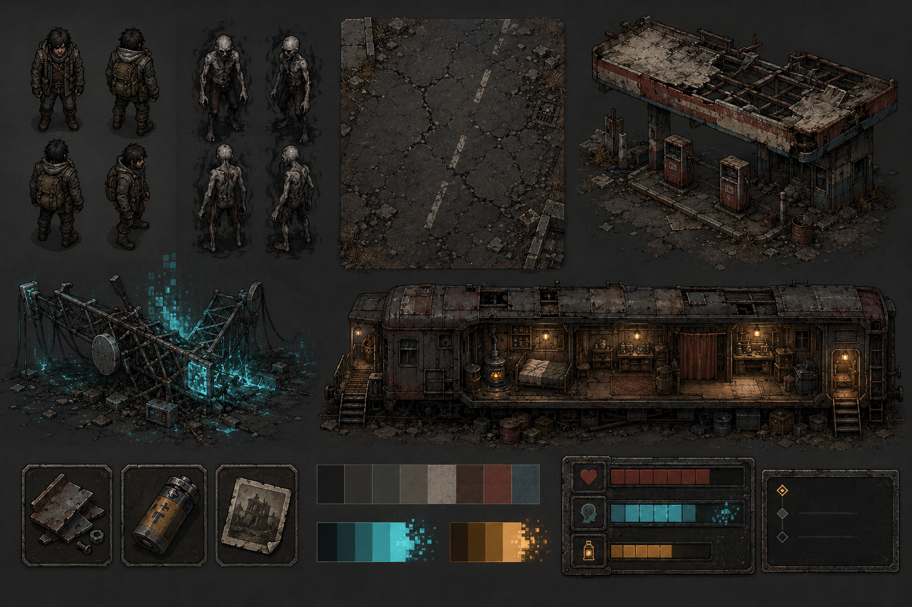

# The World Forgot Us

[](https://godotengine.org/)
[](https://github.com/JamieP-205/the-world-forgot-us/actions/workflows/pages.yml)
[](LICENSE)

> In this world, survival is not enough. Someone has to remember.

**The World Forgot Us** is a complete compact 2D memory-survival game created by Jamie Parr. Explore an ash-covered Britain, fight signal-corrupted enemies, recover memories the world has erased, rebuild the Railhome, and decide what humanity should do with the machine that caused the Forgetting.

[Play in your browser](https://jamiep-205.github.io/the-world-forgot-us/) · [Read the design bible](master-design-bible.md) · [Report a bug](https://github.com/JamieP-205/the-world-forgot-us/issues)



## The game

This repository contains the full source and browser build pipeline for a handcrafted 35-50 minute narrative campaign:

- **Act I - Rustway:** scavenge a ruined petrol-station road, build the Scanner Coil, recover The Last Broadcast, and bring the Radio Desk online.
- **Act II - Ashmere Verge:** answer Mara Venn's delayed signal and uncover why the missing posters know the protagonist's name.
- **Act III - Broadcast Fields:** restore three memory relays while fighting Hollows, scan-dependent Static Wraiths, and the shielded Relay Husk.
- **Finale - Choir Core:** survive the Choir Warden and choose the Archive, Silence, or secret Choir ending.

Progress saves between sessions. Optional echoes, keepsakes, and the Memory Shelf determine whether the third ending is available.

## Highlights

- Four authored regions with backtracking, route landmarks, loot loops, environmental storytelling, optional discoveries, and boss arenas.
- Responsive top-down combat with directional melee, invulnerable dodge, healing rations, scanner reveals, boss shield breaks, and the unlockable Memory Burst.
- Three enemy archetypes: Hollow, Static Wraith, and the phased Relay Husk / Choir Warden boss.
- Five recoverable memory echoes, a readable in-game Archive, staged dialogue, explicit objectives, compass guidance, save/load, death recovery, and three endings.
- Railhome upgrades including the Scanner Coil, Radio Desk, Signal Lantern, Memory Shelf, storage, and rest/save point.
- Real-time Godot 2D lighting with normal-mapped sprites, dynamic PointLight2D sources, scanner flashes, geometry-derived LightOccluder2D shadows, and chapter-specific colour palettes.
- A custom memory-lantern chiaroscuro grade: cold ash shadows, warm survivor light, cyan echo illumination, restrained grain, vignette, and memory-only chromatic fracture.
- Procedural sound design and atmospheric drone generated in-engine, with distinct cues for combat, scanning, dialogue, relays, memories, building, and endings.
- Mouse and keyboard support, visible telegraphs, objective guidance, fullscreen Web mode, and a custom accessible browser launch shell.

## Controls

| Action | Input |
| --- | --- |
| Move | WASD or Arrow keys |
| Interact / advance dialogue | E |
| Melee attack | J or Left-click |
| Mnemoscope scan | Q or Right-click |
| Dodge | Space |
| Memory Burst | R, unlocked in Act II |
| Eat a ration | F |
| Open Archive | I |
| Pause | Esc |

Scanner pulses reveal memory echoes and Static Wraiths. They also disable boss shields for a short damage window.

## Run locally

Requirements:

- [Godot 4.7](https://github.com/godotengine/godot-builds/releases/tag/4.7-stable)

Open [project.godot](project.godot) in Godot and press **F6**, or run:

```powershell
& "C:\path\to\Godot_v4.7-stable_win64_console.exe" --path .
```

The project starts at the title screen. Saves live in Godot's per-user `user://savegame.json` location.

## Build and serve the Web edition

The committed `Web` export preset is single-threaded, so a normal static host works without cross-origin isolation headers.

Install only the official Web template from Godot's release archive:

```powershell
python web/install_godot_web_template.py `
  --archive-url "https://github.com/godotengine/godot-builds/releases/download/4.7-stable/Godot_v4.7-stable_export_templates.tpz" `
  --output-dir "$env:APPDATA\Godot\export_templates\4.7.stable" `
  --template web_nothreads_debug.zip `
  --template web_nothreads_release.zip
```

Export and host:

```powershell
New-Item -ItemType Directory -Force builds\web
& "C:\path\to\Godot_v4.7-stable_win64_console.exe" --headless --path . --export-release "Web" "builds/web/index.html"
python -m http.server 8060 --bind 127.0.0.1 --directory builds\web
```

Open <http://127.0.0.1:8060/>.

## Quality checks

Run the complete deterministic campaign smoke test with an isolated user-data directory:

```powershell
$env:APPDATA = "$PWD\.godot\complete_smoke_appdata"
& "C:\path\to\Godot_v4.7-stable_win64_console.exe" --headless --path . --scene res://tools/complete_game_smoke.tscn
```

Expected output:

```text
COMPLETE_GAME_SMOKE: PASS
```

The test loads every required scene and resource, traverses all four chapters, verifies both bosses and the persistent HUD, checks runtime normal-map pairing plus generated shadow lights/occluders, and resolves a complete ending.

## Project structure

```text
assets/                 Source and processed game art
resources/              Items, upgrades, echoes, and animation data
scenes/                 Maps, player, enemies, world objects, and UI
scripts/                Modular gameplay, campaign, rendering, and UI code
shaders/                Memory-lantern screen grade
tools/                  Asset and end-to-end verification tooling
web/                    Custom browser shell and template installer
.github/workflows/      Automated GitHub Pages export and deployment
```

Key systems are deliberately modular: `CampaignSystem`, `SaveManager`, `WorldState`, `InventorySystem`, `ArchiveSystem`, `BaseUpgradeSystem`, `LightingDirector`, player abilities, enemy AI, and reusable interactables communicate through a small event bus.

## GitHub Pages

Every push to `main` or `master` runs the Pages workflow. It downloads the verified Godot 4.7 editor, extracts only the single-threaded Web template from the official archive, imports the project, exports the custom Web shell, validates the `.wasm`, `.pck`, and JavaScript artifacts, and deploys them to GitHub Pages.

## Contributing and security

See [CONTRIBUTING.md](CONTRIBUTING.md) for the development workflow. Please report security issues privately as described in [SECURITY.md](SECURITY.md).

## Credits

Created by **Jamie Parr**.

Built with [Godot Engine](https://godotengine.org/). Game source and project-owned assets are released under the [MIT License](LICENSE).
